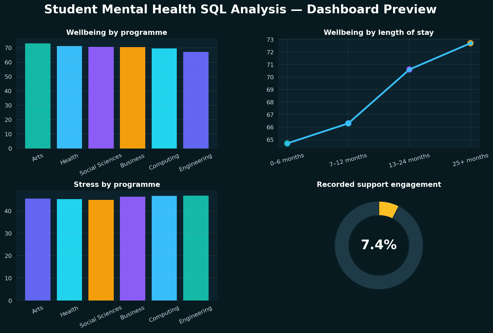
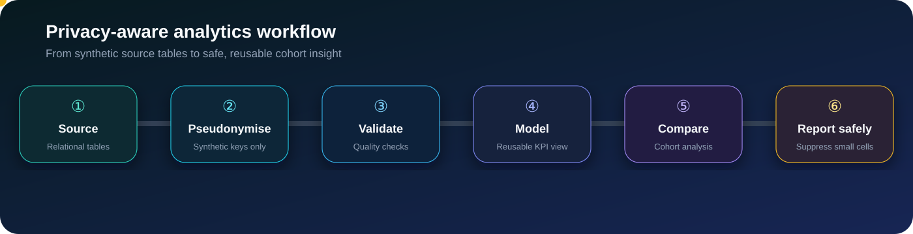

<div align="center">
  

  <br />

  
  
  
  
  [](https://fowziafaria1234-ops.github.io/student-mental-health-sql-analysis/dashboard/)
</div>

## 🧠 Project overview

This project explores student wellbeing through a **relational SQLite model** and a reusable KPI view. It demonstrates how SQL can turn multiple source tables into safe, repeatable cohort reporting across programme, study level, international status and length of stay.

> **Portfolio note:** Every record is synthetic and pseudonymised. This repository is an analytics demonstration, not a clinical tool or an official student-record system.

### At a glance

| Area | What this project demonstrates |
|---|---|
| **Data model** | Programmes, students, wellbeing assessments and support engagement |
| **SQL methods** | Joins, CTEs, `CASE` cohorting, aggregations, reusable views and window functions |
| **Quality controls** | Duplicate checks, range checks, referential integrity and source-to-view validation |
| **Privacy design** | Pseudonymous keys, small-cell suppression and no direct personal identifiers |
| **Delivery** | Reproducible Python pipeline, SQLite database, notebook, tests and live dashboard |

<div align="center">
  
</div>

## 📌 Demonstration insights

| KPI | Result |
|---|---:|
| Students represented | **900** |
| Average wellbeing score | **70.3** |
| Average stress score | **45.9** |
| Highest programme wellbeing | **Arts** |
| Recorded support engagement | **7.4%** |
| Longest-stay vs newest-cohort difference | **8.0 points** |

## 🔐 Privacy-first analytical workflow

<div align="center">
  
</div>

The workflow is intentionally designed around **safe aggregate reporting**:

- 🔑 Uses synthetic `student_key` values instead of direct identifiers
- 🧱 Keeps source tables separate from the reusable analytical view
- 🧪 Validates ranges, duplicates and relational integrity before reporting
- 👥 Applies cohort logic consistently through SQL views and CTEs
- 🛡️ Includes minimum-cell-size controls for safer external summaries
- 📊 Reports patterns at cohort level rather than making individual judgements

## 🧾 SQL portfolio

| Script | Purpose |
|---|---|
| [`01_schema.sql`](./sql/01_schema.sql) | Defines the relational structure |
| [`02_data_quality_checks.sql`](./sql/02_data_quality_checks.sql) | Tests duplicates, ranges and relationships |
| [`03_kpi_view.sql`](./sql/03_kpi_view.sql) | Creates the reusable student KPI view |
| [`04_cohort_analysis.sql`](./sql/04_cohort_analysis.sql) | Compares key wellbeing cohorts |
| [`05_window_functions.sql`](./sql/05_window_functions.sql) | Demonstrates ranking and analytical windows |
| [`06_privacy_controls.sql`](./sql/06_privacy_controls.sql) | Applies safer aggregate-reporting rules |

## 🗂️ Repository structure

```text
student-mental-health-sql-analysis/
├── .github/workflows/          # Automated reproducibility checks
├── assets/                     # Modern visuals and dashboard preview
├── dashboard/index.html        # Interactive browser dashboard
├── data/raw/                   # Synthetic source tables
├── data/processed/             # KPI view, summaries and SQLite database
├── docs/INSIGHT_REPORT.md      # Business-facing findings
├── notebooks/                  # Reproducible walkthrough
├── sql/                        # Schema, checks, views and analysis
├── src/                        # Data generation and database pipeline
└── tests/                      # Output and SQL validation tests
```

## ▶️ Run locally

```bash
python -m venv .venv
# Windows: .venv\Scripts\activate
# macOS/Linux: source .venv/bin/activate
pip install -r requirements.txt
python src/run_pipeline.py
pytest -q
```

Open `dashboard/index.html` to explore the animated dashboard, or inspect `data/processed/student_wellbeing.db` using DB Browser for SQLite.

## 📚 Supporting material

- [Interactive dashboard](https://fowziafaria1234-ops.github.io/student-mental-health-sql-analysis/dashboard/)
- [Jupyter notebook](./notebooks/Student_Mental_Health_SQL_Analysis.ipynb)
- [Insight report](./docs/INSIGHT_REPORT.md)
- [Data dictionary and privacy design](./DATA_DICTIONARY.md)

---

<div align="center">
  <strong>Designed as a transparent SQL portfolio project by Faria Islam.</strong><br />
  <sub>Reliable metrics · responsible reporting · reproducible analysis</sub>
</div>
